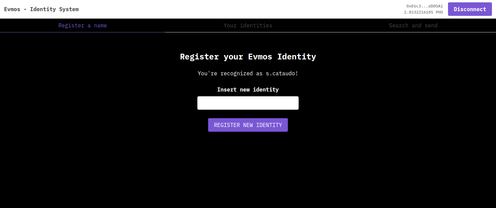
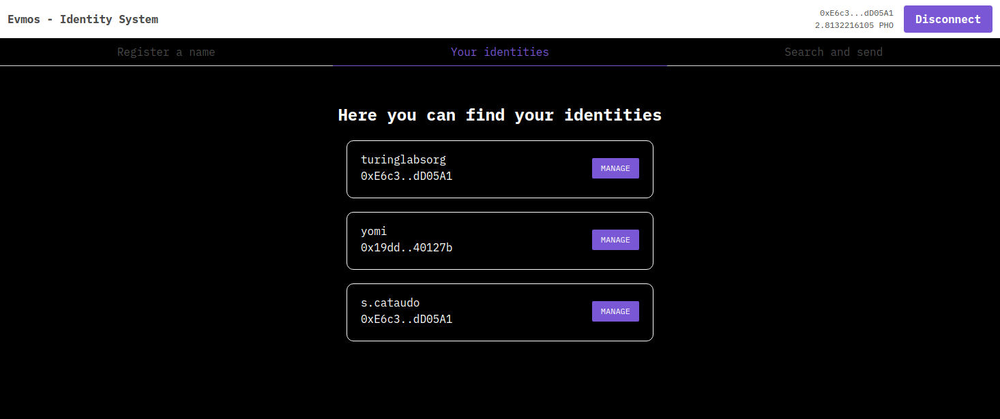
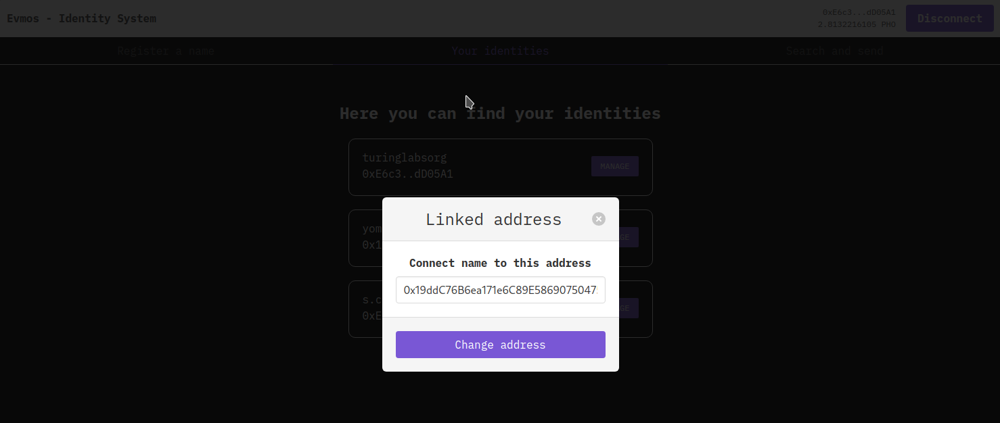

# Evmos - Identity on Evmos

This is a basic example of and identity system contract with an UI to interact with.

Folders are divided in:
- `contract`: which contains all contract files
- `ui`: which contains user interface

Contract is live here: https://id.ownlabs.dev/ and the contract can be accessed at `0xB8e8Fe40aFf48Ef6DE58eb73186e45792824fF3d`.

## How it works

The contract maintains a record of all names registered inside the blockchain and allows some basic management.

Each name can only be registered once and can have a single owner. 

The owner can also decide to transfer the name to another user.

There's also an indexer inside the contract, so anyone can search for a name or recognize if an address owns a name or not.

### Register your identity

To register an identity you have to call the `setIdentity` method inside the contract, or do it via the UI like showed here:


In both cases you've to pass a `string` representing your name.

### Manage your identities
As shown in the UI you can fetch all the owned identities from the contract using the `returnOwnedByAddress` method by passing your address or the address you want to investigate.



After you've found your names, you can manage it, by changing the link (exactly like ENS on Ethereum does) it points by calling the `changeLink` method inside the contract. You can do it via UI by clicking on "MANAGE" button:



### Transfer

Transfer can be done only with the contract at the moment, but it can be done by calling the `transferName` method inside the contract.

## Build the project

To build the project you first need to install `node` and `yarn`, then you can compile the contract and the ui.

### Compile the contract

To compile the contract you first need to setup a configuration file like the `contract/configs/example.json`, where you need to add some basic configurations.
Then you can run these commands:

```
cd contract
yarn
npm run build evmos
```

At the end of the process you will be able to run tests:

```
npm run test:mint evmos
```

### Build the UI

If you want to build the UI you need to run following commands:

```
cd ui
yarn
npm run build
```

